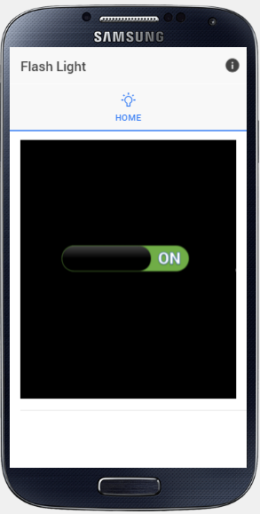
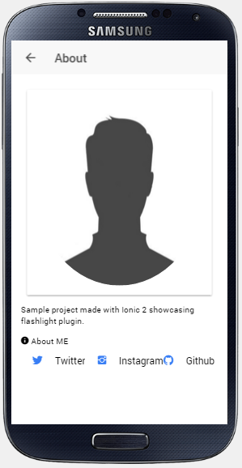

# ionic2flashlight

Sample project made with Ionic 2 showcasing:
1. Flashlight plugin.
2. Inappbrowser plugin.

Note: For Android 6.0, you may need to give camera permission to the app for flashlight to work.

#Example Cases
* Flashlight - [ [template](https://github.com/emartsoft/ionic2flashlight/blob/master/app/pages/home-page/home-page.html#L9-L14) |
[code](https://github.com/emartsoft/ionic2flashlight/blob/master/app/pages/home-page/home-page.ts#L30-L44) ]

* Inappbrowser - [ [template](https://github.com/emartsoft/ionic2flashlight/blob/master/app/pages/about-page/about-page.html#L23-L48)]

#App Preview

